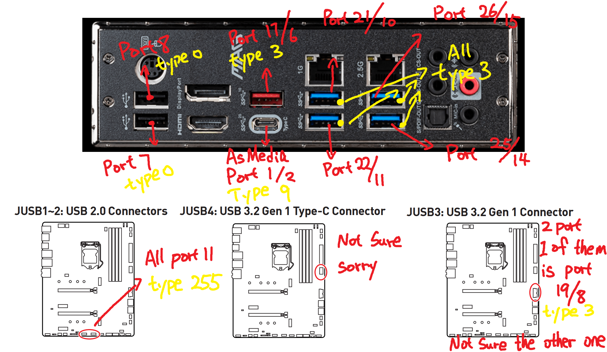

# MSI-Z490-Tomahawk-OpenCore

Hi, this is my own take of OpenCore configuration with MSI Z490 Tomahawk

------------

## System Spec:

​	CPU: 				 i9 10858k (OCed to 4.9Ghz All Core, 4.7Ghz Ring Clock)

​	Cooling: 		   Custom Water Cooling (WIP, doesn't affect this project)

​	Motherboard:  MSI Z490 Tomahawk (BIOS Ver: E7C80IMS.190)

​	RAM:				  Crucial Ballistix 16G*2 3600 (C9BLH) OCed to 4400Mhz 17-21-21-38-660 All 2nd/territary subtiming tweaked (doesn't affect this project)

​	SSD:					WD SN750 1TB(Windows), Samsung 980 1TB(Macos), WD40EZRZ

​	GPU:					Reference AMD RX 6800 XT (Manufacturered by MSI)

​	WiFi:					BCM94360

​	PSU:					Thermaltake GF1 750w (Doesn't affect this project)

 (I was using Intel AX200, however I was not able to get bluetooth working, even with different versions of IntelBluetoothFirmware.kext and BlueToolFixup.kext, changing USB Port type won't work either, if someone could let me know why it would be great)

-------

## What's Working and what's not:

OpenCore: 0.7.7

OS: Monterey 12.1 Latest Update (As of 2022/Jan/23)

Everything seems to be working (WiFi, bluetooth, USB, Sleep, Wake, dGPU, iGPU, Audio)

What's not tested(but should be working): Both Lan Port, Rear Audio

PS2 port has not been taken care of, but should work after apply VoodooPS2.Kext

----------------

## Instruction

Note: Please Cross Reference my config with [Dortania's Guide](https://dortania.github.io/OpenCore-Install-Guide/), you should NEVER trust word from one person only, including me.

**Some of the config has been setup according to my own requirement which might not suit you**, for example USB Mapping would be slightly different if your computer case IO is different to mine (I have 1x USB3.0 port and 2x USB2.0 port on the Case's front IO) **My Guide will hopefully cover all the customize part, let me know if I missed anything.**

##### 1.  Necessary BIOS Config

- Disable CFG Lock
- Disable Fastboot
- Enable XMP Profile for RAM
- Enable Above 4G decoding
- Enable iGPU 64MB
- Actually a lot more ---- **WIP**

##### 2. Prepare your own USB Installer, and copy my EFI folder to the EFI Partition of the USB. 

To Mount EFI Folder:

On Mac: [MountEFI](https://github.com/corpnewt/MountEFI) 

On Windows: 

    diskpart
    lis dis
    sel dis X
    lis par
    sel par Y
    assign letter=Z

X refers to the Disk your EFI partition is located at

Y refers to the Partition of your EFI Partition (usually 1)

Z refers to the Letter you want to mount your drive

Note After mount the partition is won't be accessible with explorer unless you kill the explorer process and launch it again with Admin prevelidge, a simple workaround is to **use a alternative file explorer** like **Explorer++** with **Admin prevelidge**.

##### 3. Setup the SMBIOS with the Generator

To Edit the config.plist, you can use [ProperTree](https://github.com/corpnewt/ProperTree) (Note, to use this app, you will need to install [Python](https://www.python.org/downloads/) 3.9+ first, the MacOS pre-installed Python isn't sufficient enough. Then navigate to ~/ProperTree/Scripts, and run buildapp-select.command to build a MacOS app.)

To Generate SMBIOS, you can use [GenSMBIOS](https://github.com/corpnewt/GenSMBIOS), it is pretty straight forward(Press 1 to Install MacSerial first, then follow the instruction, you want to generate SMBIOS for **iMac20,2**). Place the generated data into PlatformInfo/Generic of your config.plist

Short Direction of using GenSMBIOS:

1. Run GenSMBIOS.command
2. Press 1, install MacSerial
3. Press 2, drag my config.plist into it
4. press 3, then type exactly "**iMac20,2**" , press enter.
5. press 4,
6. press 5

You are done.

**NOTE:** iMac20,2 should be good for Z490 platform, if you have a different motherboard please check other guide, YMMV.

##### 3. Install MacOS 

Detail won't be provided, please refer to Dortania's Guide

##### 4. Post-Install

[Place your EFI Folder to MacOS drive](https://dortania.github.io/OpenCore-Post-Install/universal/oc2hdd.html#grabbing-opencore-off-the-usb)

##### 5. Do your own USBMap

I used [USBToolBox](https://github.com/USBToolBox/tool) for convenience. It works out perfect for this board, if you care about every second of your boot time, maybe use DSDT Patch method instead. 

[Download](https://github.com/USBToolBox/tool/releases/tag/0.0.9) Windows.zip, unzip and run **windows.exe** .

press D, it will load into a port detection interface.

You will want to grab a pen and paper, then 

​		plug in a USB Drive to a port, note down its port number, then 

​		plug it to the another port, note down its port number, 

until you go through EVERY PORT.

**Once you done**, press Q and then press S, you can try to enable/disable ports as you wish.

Above is my port discovery FYI, I do not know the Internal Type-C port number, and I only know port number for 1 out of 2 of the Internal USB 3.0 Header. Please test yourself.

**To enable/disable a port**, just key in its port number,

**To change a port's type**, type "T:PortNumber:xxx"    Example: to change Port 2 to type 255, "T:2:255" 

then generate UTBMap.kext, and place it in your EFI/OC/Kexts folder (and add to your config.plist, my config.plist have it added already)

##### 6. Good to know(My personal Experience)

When you add kext entry to your config.plist, **the order matters**

For example, you need to put VirtualSMC.kext before SMCProcessor.kext, otherwise SMCProcessor.kext won't load properly as its dependency isn't loaded yet.

##### 7. Nice to have

**Allow your bluetooth device to connect to both your Windows/Mac without needing to pair them again.** Credit to [Dortania](https://github.com/dortania/clover-laptop-guide/blob/master/extras/dual-booting-with-bluetooth-devices.md) and u/TheVoyvode from [Reddit](https://www.reddit.com/r/hackintosh/comments/p5ost3/macos_monterey_and_windows_bluetooth_pairing/) 

Todo:

1. Pair your BT device in Windows
2. Reboot, Pair the same device in Mac again.
3. Open **KeyChain Access** search "bluetooth" on top right search box, find MobileBluetooth on the bottom of the list, double click it, make sure the MAC address is the device you want to play with.
4. Check "show password" checkbox, enter User name/password twice, then Command+A, Command + C the text box. The **LinkKey** Attribute is what you want to take note of (Write it down, take a photo, send yourself a email, etc.)
5. Reboot to Windows, open **regedit**, navigate to HKEY_LOCAL_MACHINE\SYSTEM\CurrentControlSet\Services\BTHPORT\Parameters\Keys\
6. You probably won't see any entries under Keys, you want to right click Keys -> Permissions -> Add -> enter your user name in the bottom text box -> press "Check Names" -> Press Ok -> Click your User Name -> check every checkbox under allow -> Press OK -> Close Regedit and reopen it again.
7. Now you will be able to see all attributes named by their MAC address, copy the LinkKey over as-is (you don't need to change the order like what Dortania's guide said, just straight copy from begin to end)
8. All done

**Enable ResizebleBar support**

WIP, guide will upload soon

